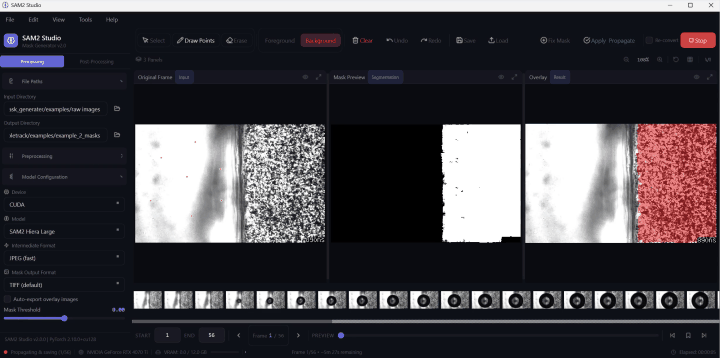

# SAM2 Studio — Mask Generator for DIC & ROI Recognition

A professional desktop application for automatic mask generation in Digital Image Correlation (DIC) and Region of Interest (ROI) workflows.
Powered by [Meta SAM2](https://github.com/facebookresearch/sam2) with a full-featured PyQt6 GUI.

<p align="center">
  
</p>

---

## Highlights

| Capability | Details |
|---|---|
| **Interactive Annotation** | Point-based foreground/background marking with undo/redo history (up to 100 steps) |
| **Mid-Sequence Correction** | Fix inaccurate masks on any frame and re-propagate forward — no need to reprocess the entire sequence |
| **Multi-Model Support** | SAM2 Hiera Large / Base Plus / Small / Tiny — pick quality vs speed |
| **GPU Acceleration** | CUDA auto-detection for NVIDIA GPUs (~100x faster than CPU) with real-time VRAM monitoring |
| **28-Parameter Preprocessing** | Tone, smoothing, binarization, morphology, anisotropic diffusion — with 7 built-in presets including DIC Microscopy |
| **Post-Processing** | Perona-Malik spatial smoothing + 3D Gaussian temporal smoothing with smart chaining and mask view switcher |
| **Three-Panel Canvas** | Original / Mask / Overlay side-by-side with synchronized zoom, pan, grid overlay, and panel maximize |
| **Project Persistence** | Save/load complete workspace state (`.s2proj`), annotation configs, and preprocessing presets |
| **Export** | Mask output in TIFF/PNG, contour export in PNG/SVG, optional overlay images |
| **Batch Processing** | Queue multiple image directories for sequential processing |

---

## Demo

### Mask Generation Workflow

<p align="center">
  
</p>

### Post-Processing Smoothing

<p align="center">
  
</p>

---

## Installation

### Prerequisites

- Python 3.10+
- NVIDIA GPU with CUDA support (recommended; CPU fallback available)
- SAM2 model checkpoints

### Step 1: Install PyTorch with CUDA

Check your NVIDIA driver version with `nvidia-smi`, then install the matching PyTorch:

```bash
# CUDA 12.8 (driver >= 570)
pip install torch torchvision --index-url https://download.pytorch.org/whl/cu128

# CUDA 12.6 (driver >= 560)
pip install torch torchvision --index-url https://download.pytorch.org/whl/cu126

# CPU only (no GPU)
pip install torch torchvision --index-url https://download.pytorch.org/whl/cpu
```

Verify CUDA is working:

```bash
python -c "import torch; print(torch.cuda.is_available(), torch.cuda.get_device_name(0))"
# Expected: True NVIDIA GeForce RTX ...
```

### Step 2: Install dependencies

```bash
pip install -r requirements.txt
```

### Step 3: Download SAM2 checkpoints

Download model weights from [facebookresearch/sam2](https://github.com/facebookresearch/sam2) and place them in `checkpoints/`:

```
checkpoints/
├── sam2.1_hiera_large.pt      # Best quality (~900 MB)
├── sam2.1_hiera_base_plus.pt  # Balanced
├── sam2.1_hiera_small.pt      # Faster
└── sam2.1_hiera_tiny.pt       # Fastest (~150 MB)
```

> You only need **one** checkpoint to get started. `hiera_large` gives the best results; `hiera_tiny` is fine for quick tests.

### Step 4: Launch

```bash
python main.py
```

---

## Workflow

```
┌──────────┐    ┌──────────┐    ┌──────────┐    ┌──────────┐    ┌──────────┐
│  1. Set   │ -> │2. Annota-│ -> │3. Process│ -> │4. Review │ -> │5. Post-  │
│Directories│    │   te     │    │  (SAM2)  │    │ & Correct│    │Processing│
└──────────┘    └──────────┘    └──────────┘    └──────────┘    └──────────┘
```

1. **Set Directories** — Select input image folder and output folder from the sidebar or `File > Open Input Directory`.
2. **Annotate** — Press `D` to activate the draw tool, then click on the first frame to place foreground (green) and background (red) points. Press `Space` to toggle between foreground and background mode.
3. **Process** — Click *Start Processing* or press `Ctrl+Enter`. SAM2 propagates annotations across all frames. Progress bar with ETA is shown in the status bar.
4. **Review & Correct** — Browse generated masks frame by frame. If a mask is inaccurate, click *Fix Mask* on that frame, add correction points, then click *Apply & Propagate* to re-generate from that frame forward.
5. **Post-Processing** — Switch to the Post-Processing panel for spatial/temporal smoothing. Use the *Viewing Masks From* selector to compare Original, Spatial Smoothed, and Temporal Smoothed results.

> See the [User Manual](docs/USER_MANUAL.md) for a detailed walkthrough of every feature.

---

## Keyboard Shortcuts

### Tool Selection

| Key | Action |
|-----|--------|
| `V` | Select / Move tool |
| `D` | Draw points tool |
| `E` | Erase points tool |
| `Space` | Toggle foreground / background mode |

### Editing

| Key | Action |
|-----|--------|
| `Ctrl+Z` | Undo annotation |
| `Ctrl+Y` / `Ctrl+Shift+Z` | Redo annotation |
| `Ctrl+Click` | Toggle point selection |
| `Delete` | Delete selected points |

### Navigation

| Key | Action |
|-----|--------|
| `Left` / `Right` | Previous / Next frame |
| `Home` / `End` | First / Last frame |
| `Ctrl+G` | Go to frame (dialog) |
| `M` | Toggle bookmark on current frame |

### File Operations

| Key | Action |
|-----|--------|
| `Ctrl+N` | New project |
| `Ctrl+Shift+O` | Open input directory |
| `Ctrl+Shift+S` | Save project (`.s2proj`) |
| `Ctrl+Shift+P` | Open project |
| `Ctrl+S` | Save annotation config |
| `Ctrl+O` | Load annotation config |
| `Ctrl+Q` | Exit |

### Processing & View

| Key | Action |
|-----|--------|
| `Ctrl+Enter` | Start processing |
| `Escape` | Stop / Cancel |
| `Ctrl+0` | Reset zoom |
| `Ctrl+1` | Fit to window |
| `Scroll Wheel` | Zoom in / out |
| `Middle-click drag` | Pan view |
| `F1` | Show shortcuts dialog |

---

## Features

### Three-Panel Canvas

The main workspace shows three synchronized panels side by side:

- **Original Frame** (Input) — Interactive annotation canvas for placing foreground/background points
- **Mask Preview** (Segmentation) — Real-time binary mask display
- **Overlay** (Result) — Original image with mask overlay for visual verification

Each panel supports:
- **Eye toggle** — Show/hide the panel content
- **Maximize** — Expand a single panel to full width (click again to restore all three)
- **Grid overlay** — Toggle an 8x8 reference grid across all panels
- **A/B comparison** — Toggle the overlay panel between result and original for quick comparison
- **Synchronized zoom & pan** — All panels zoom and pan together

### Preprocessing Pipeline

The sidebar **Processing** panel provides a 28-parameter preprocessing pipeline with live preview (500ms debounce). Parameters are grouped into hover-popup categories:

| Category | Parameters |
|----------|-----------|
| **Tone** | Gain, Brightness, Contrast, Clip Min/Max, CLAHE (clip limit, tile size) |
| **Smoothing** | Gaussian sigma, Bilateral filter, Median filter, Box filter, NLM denoise, Anisotropic diffusion |
| **Binarize** | Binary threshold (Fixed / Otsu / Adaptive), Invert |
| **Morphology** | Dilate, Erode, Open, Close, Gradient, Top-hat, Black-hat (kernel size, iterations), Fill holes |
| **Shapes** | Add (fill white) or Cut (fill black) rectangles, circles, and polygons |

**Built-in presets**: None (identity) | DIC Microscopy | Fluorescence | Phase Contrast | Brightfield | High Noise (Denoise) | Edge Enhancement

Custom presets can be saved/loaded as JSON files.

### Post-Processing Panel

After segmentation, switch to the **Post-Processing** panel:

- **Mask View Switcher** — Toggle between viewing Original masks, Spatial Smoothed, or Temporal Smoothed results. New options appear automatically after applying smoothing.

- **Spatial Smoothing** — Perona-Malik anisotropic diffusion on each mask independently.
  Smooths jagged boundaries while preserving overall shape.
  - Parameters: iterations, dt (time step), kappa (conductance), diffusion option

- **Temporal Smoothing** — 3D Gaussian filter for cross-frame coherence.
  **Smart chaining**: automatically reads from spatial smoothing output when available, enabling a natural Spatial → Temporal pipeline without manual configuration.
  - Parameters: sigma, number of neighbors, variance threshold for bad-frame detection

- **Mask Statistics** — Area coverage, frame-to-frame consistency, anomaly detection

Both smoothing operations show a progress bar with ETA and auto-switch the display on completion.

### Mask Correction (2-Step Workflow)

After processing, if a mask is inaccurate on any frame:

1. **Fix Mask** — Navigate to the problematic frame and click *Fix Mask* in the toolbar. Add correction foreground/background points on that frame.
2. **Apply & Propagate** — Click *Apply & Propagate* to re-generate masks from the corrected frame forward. Only subsequent frames are recomputed — earlier frames remain unchanged.

This is critical for long sequences (hundreds/thousands of frames) where errors accumulate: you can fix frame 500 without reprocessing frames 1–499.

### Model Configuration

| Setting | Options |
|---------|---------|
| **Model** | SAM2 Hiera Large / Base Plus / Small / Tiny |
| **Device** | CUDA (auto) / CPU / MPS |
| **Mask Threshold** | -5.0 to +5.0 (logit threshold for binarization) |
| **Intermediate Format** | JPEG (fast) / PNG (lossless) |
| **Mask Output Format** | TIFF (default) / PNG (lossless) |

### Project Save/Load

- **Save Project** (`Ctrl+Shift+S`) — Saves complete workspace state as `.s2proj` (JSON):
  input/output paths, model config, annotations, preprocessing, frame range, marked frames, overlay settings.
- **Open Project** (`Ctrl+Shift+P`) — Restores the entire workspace from a saved project.
- **Recent Projects** — Quick access from `File > Recent Projects`.

### Batch Processing

`Tools > Batch Processing...` opens a dialog to queue multiple input directories. Each directory is processed sequentially with the current model settings and annotation configuration.

### Contour Export

`Tools > Export Contours as PNG/SVG...` extracts boundaries from generated masks:
- **PNG** — Rasterized white contours on black background.
- **SVG** — Vector format, resolution-independent, suitable for publications.

---

## Project Structure

```
Mask_generater/
├── main.py                        # Application entry point
├── controllers/                   # MVC controllers
│   ├── app_state.py               # Central state manager (signals)
│   ├── annotation_controller.py   # Undo/redo command pattern
│   ├── processing_controller.py   # SAM2 processing orchestration
│   ├── smoothing_controller.py    # Spatial/temporal smoothing workers
│   ├── preview_controller.py      # Preprocessing preview rendering
│   ├── shape_controller.py        # Shape overlay management
│   └── workers/                   # Background QThread workers
│       ├── processing_worker.py   # Main SAM2 propagation
│       ├── correction_worker.py   # Mid-sequence correction
│       └── preprocessing_save_worker.py
├── core/                          # Core algorithms (no GUI dependency)
│   ├── mask_generator.py          # SAM2 video predictor wrapper
│   ├── image_processing.py        # Unicode-safe image I/O, conversion
│   ├── preprocessing.py           # 28-step immutable preprocessing pipeline
│   ├── spatial_smoothing.py       # Perona-Malik anisotropic diffusion
│   ├── temporal_smoothing.py      # 3D Gaussian temporal smoothing
│   ├── contour_export.py          # Contour extraction (PNG/SVG)
│   ├── annotation_config.py       # Annotation save/load
│   └── project.py                 # Project save/load (.s2proj)
├── gui/                           # PyQt6 GUI layer
│   ├── main_window.py             # Main window, menus, signal wiring
│   ├── theme.py                   # Dark theme (colors, fonts, stylesheet)
│   ├── icons.py                   # Inline SVG icon generator (Lucide-style)
│   ├── panels/                    # UI panels
│   │   ├── sidebar.py             # Switchable Processing / Post-Processing sidebar
│   │   ├── canvas_area.py         # Triple-view canvas with zoom bar
│   │   ├── canvas_panel.py        # Individual canvas with annotations & grid
│   │   ├── toolbar.py             # Tool selection + correction toolbar
│   │   ├── frame_navigator.py     # Frame slider, bookmarks, navigation
│   │   ├── filmstrip.py           # Thumbnail strip with lazy loading
│   │   └── status_bar.py          # Status, progress bar, VRAM, timer
│   ├── widgets/                   # Reusable widgets
│   │   ├── path_selector.py       # Directory browser
│   │   ├── slider_input.py        # Labeled slider + spinbox
│   │   ├── number_input.py        # Labeled numeric input
│   │   ├── select_field.py        # Dropdown selector
│   │   ├── collapsible_section.py # Collapsible panel section
│   │   ├── hover_popup_button.py  # Category button with popup panel
│   │   └── shape_drawing.py       # Interactive shape drawing tools
│   └── dialogs/                   # Modal dialogs
│       ├── batch_dialog.py        # Batch processing queue
│       ├── welcome_dialog.py      # First-run welcome screen
│       └── shortcuts_dialog.py    # Keyboard shortcuts reference
├── utils/
│   └── device_manager.py          # GPU detection, VRAM monitoring
├── sam2/                          # Meta SAM2 model code
├── checkpoints/                   # Model weights (not tracked in git)
├── tests/                         # Test suite (232 tests)
├── assets/                        # Demo videos and screenshots
├── docs/
│   └── USER_MANUAL.md             # Detailed user manual
└── requirements.txt
```

---

## Architecture

SAM2 Studio uses **MVC + Signal-Driven Reactive State**:

- **AppState** — Single source of truth. All state changes emit PyQt6 signals.
- **Controllers** — Modify state through AppState methods. Background work runs in QThread workers.
- **GUI Panels** — Observe state via signal connections. No direct inter-panel communication.

State machine: `INIT` → `ANNOTATING` → `PROCESSING` → `REVIEWING` → `CORRECTION` → `POST_PROCESSING`

Key design decisions:
- Immutable data (`@dataclass(frozen=True)` for `PreprocessingConfig`)
- Command pattern for undo/redo (`AnnotationController`)
- Worker threads copy data at construction time — no shared mutable state
- Unicode-safe I/O (`imread_safe` / `imwrite_safe`) for Windows CJK path support

---

## What Makes This Different from SAM2 / YOLO?

| | SAM2 Official | YOLO Series | SAM2 Studio |
|---|---|---|---|
| **Interface** | Jupyter Notebook / Python API | CLI / Python API | Full desktop GUI |
| **Preprocessing** | None | Basic augmentation | 28-parameter pipeline with 7 presets |
| **Video Propagation** | Yes (code-only) | No (single-frame) | Yes (GUI + correction) |
| **Mid-Sequence Fix** | Manual code | N/A | 2-click Fix & Propagate |
| **Spatial Smoothing** | No | No | Perona-Malik anisotropic diffusion |
| **Temporal Smoothing** | No | No | 3D Gaussian + bad-frame detection |
| **Training Required** | No | Yes (custom dataset) | No (zero-shot) |
| **Project Save** | No | No | Full workspace persistence |
| **Export** | Code-only | Code-only | TIFF/PNG masks + PNG/SVG contours |

**In short**: SAM2 official gives you a model. YOLO gives you a detection framework. SAM2 Studio gives you an **end-to-end desktop tool** for DIC/ROI mask generation — from preprocessing to annotation to inference to post-processing to export, all through a GUI with zero code required.

---

## Performance Tips

- **Use GPU** — CUDA gives ~100x speedup over CPU for mask propagation.
- **Model selection** — `hiera_tiny` is ~5x faster than `hiera_large` with acceptable quality for most DIC images.
- **Auto-downsampling** — Large images (>1024px) are automatically downsampled for inference; masks are upscaled to original resolution.
- **Parallel conversion** — Image format conversion uses multi-threaded I/O (`ThreadPoolExecutor`).
- **Preprocessing preview** — Uses 500ms debounce to avoid excessive computation while adjusting sliders.

---

## Troubleshooting

| Problem | Solution |
|---------|----------|
| `torch.cuda.is_available()` returns `False` | CPU-only PyTorch installed. Reinstall with CUDA index URL (see Step 1). |
| CUDA out of memory | Use a smaller model (Tiny/Small) or reduce the frame range before processing. |
| Slow processing | Verify GPU detection in the status bar. Switch to Tiny model for quick previews. |
| `Cannot find primary config` | Ensure `sam2/configs/` directory exists with `.yaml` files. |
| Masks look blocky | Expected from auto-downsampling. Add more annotation points for better coverage. |
| Chinese/Unicode characters in file path cause errors | The app uses Unicode-safe I/O. Ensure you are running the latest version. |
| Smoothing has no visible effect | Use the "Viewing Masks From" selector to switch to the smoothed output. |
| Model weights not found | Place `.pt` files in `checkpoints/` at the project root. File names must match exactly (see Step 3). |

---

## Output Directory Structure

After processing, the output directory contains:

```
output/
├── converted_png/                # SAM2 input images (auto-converted)
├── masks/                        # Generated binary masks (TIFF or PNG)
├── overlays/                     # Optional overlay images (if enabled)
├── mask_spatial_smoothing/       # Spatially smoothed masks (if applied)
├── mask_temporal_smoothing/      # Temporally smoothed masks (if applied)
├── preprocessed/                 # Preprocessed images (if saved)
└── processing_summary.json       # Processing parameters and timing
```

---

## Testing

The project includes 232 tests covering core algorithms, UI widgets, state management, and integration:

```bash
python -m pytest tests/ -v
```

---

## Citation

If you use this software in your research, please cite:

> https://www.researchsquare.com/article/rs-5566473/v1

---

## License

This project uses the [SAM2 model](https://github.com/facebookresearch/sam2) by Meta AI, licensed under Apache 2.0.
